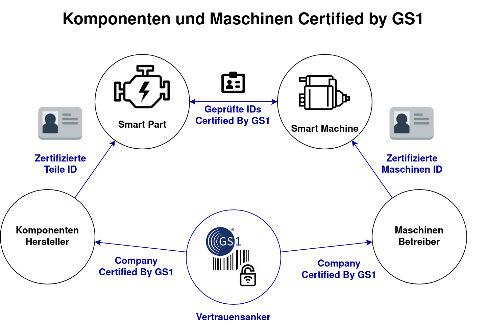

= Certified By GS1 – PKI Demonstration
Sebastian Schmittner <sebastian.schmittner@eecc.de>
:toc:
:toclevels: 4
:toc-title: Inhalt
:figure-caption: Bild
:table-caption: Tabelle
:icons: font
:xrefstyle: short
ifdef::env-github[]
:imagesdir: pics/
:tip-caption: 💡
:note-caption: ℹ️
:important-caption: ❗
:caution-caption: 🔥
:warning-caption: ⚠️
endif::[]

== USP

Bei der ID Vergabe teilt GS1 einem Unternehmen mit der Basisnummer ("Company
Prefix") einen Namensraum zu, in welchem das Unternehmen dann selbst IDs
vergeben kann. Parallel hierzu ermöglicht ein Unternehmenszertifikat mit
Basisnummer Certified By GS1 dem Unternehmen selbst Zertifikate für die eigenen
IDs zu erstellen. Diese grundlegende Idee ist in <<Chain>> dargestellt.

[[Chain]]
.Die Vertrauenswürdigkeit von Zertifikatsketten kann ausgehend vom Wurzelzertifikat überprüft werden
image::pics/Certificate-Chain.png[Zertifikatskette]

Mit dem Unternehmenszertifikat kann die Echtheit der eigenen IDs
fälschungssicher nachgewiesen und offline überprüft werden, d.h. es kann z.B.
überprüft werden, dass eine SGTIN tatsächlich von dem Unternehmen erzeugt wurde,
dem die zugehörige Basisnummer gehört, ohne das ein online Lookup in einer
entsprechenden Datenbank nötig wäre. Auch Eigenschaften des mit der ID
gekennzeichneten Assets können z.B. über die GS1 Standards in z.B. einen 2d Code
wie die Datamatrix kodiert und deren Vertrauenswürdigkeit offline verifiziert
werden.

Abgeleitete ID-spezifische Zertifikate sind besonders im IoT Kontext
interessant, da Maschinen sich mit einer solchen ID Certified By GS1 selbst
ausweisen können. Mittels etablierter kryptografischer Verfahren können
Maschinen sich basierend auf dem Certified by GS1 System gegenseitig überprüfen
und so eine gesicherte Verbindung untereinander oder auch über das Internet z.B.
zu Cloud Diensten herstellen, wie in <<Certificates>> dargestellt.

[[Certificates]]
.Vertrauen in IDs certified by GS1 ermöglicht M2M authentifizierung und den Aufbau gesicherter Kommunikationskanäle

Basierend auf digital zertifizierten Identitäten kann, genau wie bei der
gängigen Verschlüsselung der Kommunikation über das Internet, ein gesicherter
Kommunikationskanal aufgebaut werden. So können z.B. Messdaten oder
Steuerbefehle übertragen werden, ohne dass diese von dritten gefälscht werden
können.

=== Interested Partners

- EKU Power Drives https://www.ekupd.com

