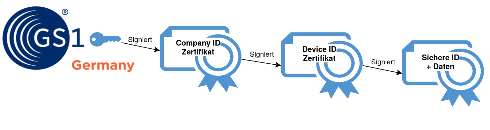

# Certified by GS1 im Industrie 4.0 IoT Kontext

## Setting und Problemstellung

![Anwendungszenario WFF aus [1]](pics/anwendungszenario-wff.png "Anwendungszenario WFF aus [1]")

Im Anwendungsszenario "Wandlungsfähige Fabrik" der industriellen Produktion 4.0 wird die moderne Fabrik von vielfältigen Maschinen (Robotern, Werkzeuge, Fördertechnik, etc.) bevölkert, die im *Internet of Things (IoT)* miteinander Kommunizieren.
Die Maschinen selbst sind dynamisch in ihren Fähigkeiten, z.B. können Roboter und Werkzeuge umkonfiguriert werden um verschiedene Aufgaben auszuführen. Vor allem aber kommen verschiedene Maschinen verschiedener Hersteller gemeinsam in einer Fertigung zum Einsatz und müssen sich möglichst direkt untereinander abstimmen, um den aktuellen Auftrag zu fertigen. Hierdurch wird ein modularer und dadurch wandlungsfähiger Aufbau der Produktion innerhalb einer Fabrik realisiert. Ähnlich wie heute die Netzwerke in Rechenzentren nicht mehr durch umstecken an großen Patchfeldern konfiguriert werden, wird auch die Fertigung der Zukunft schrittweise "software defined" um sich flexibel an immer kürze Produkt-und Innovationszyklen anzupassen.

Eine essentielle Voraussetzung hierfür ist, dass die Maschinen sich untereinander individuell identifizieren und Daten austauschen können, wie in der folgenden Grafik (angelehnt an die Veröffentlichung des VDMA [2]) dargestellt:

![Abgeleitet von: Werkzeugkaste Industrie 4.0 aus [2,3]](pics/werkzeugkaste-i40-vdma-part.png "Abgeleitet von: Werkzeugkaste Industrie 4.0 aus [2,3]")
Hervorgehoben sind die Identifikation und Einbindung von Industrial IoT (IIoT) Devices und der Datenaustausch als notwendige Voraussetzung für die Industrie 4.0.

Ein Standard für die automatische Identifikation und Authentifizierung ist unabdingbar um die Abhängigkeit von einem zentralen Plattformanbieter zu vermeiden. Zudem sind Sicherheitsfragen, insbesondere Vertrauensfragen, äußerst relevant um zu verhindern, dass unautorisierte Maschinen in die Fertigungsstraße eingebracht werden, gefälschte Daten eingeschleust werden oder gar ein unautorisierter zugriff über das Internet erfolgen kann.

## Certified by GS1

Im Rahmen des Certified by GS1 Projektes entwickelt GS1 Germany gemeinsam mit interessierten Industrieunternehmen eine Lösung für das Problem der eindeutigen und authentifizierten Identifikation von Dingen im IIoT, basierend auf den etablierten GS1 Standards und Identen und unter einbindung der technischen Expertise von GS1 Solution Providern mit langjährigem IoT Know How.

### IDs

GS1 vergibt bereits heute weltweit eindeutige und Idente nach einem anerkannten Standard.
Bekanntestes Beispiel sind die im Einzelhandel in den Barcodes (EAN) codierten Global Trade Item Numbers (GTINs). **[TODO: Wie viele GS1 Idente sind im Umlauf? Referenzkunden im Technischen/Industriellen Bereich? weitere generische Fakten?]**

Neben solchen Handelsspezifischen Identen gibt es aber auch Idente speziell für das Asset Management z.B. von Maschinen (Global Individual Asset Identifier, GIAI) und von (Maschinen-)Bauteilen (Component / Part Identifier, CPI).

Grundsätzlich vergibt GS1 einen Namensraum solcher Idente (konkrete eine numerische Präfix) an Unternehmen, die daraus dann die eigenen Idente nach dem standardisierten Schema ableiten. Ähnlich wie bei Internet Domain Names besteht der große vorteil einer zentralen registratur in der garantierten globalen eindeutigkeit der Idente und der Zuordnung der Idente zum ausstellenden Unternehmen.

Besonders interessant sind in vielen Use Cases serialisierte Idente mit deren Hilfe individuelle Teile und Maschinen identifiziert werden können. Ein solches Ident kann, ähnlich wie die Personalausweisnummer, eine Maschine oder einen Sensor eindeutig Identifizieren und von baugleichen Maschinen unterscheiden, um z.B. Wartungen und Umkonfiguration eindeutig zuordnen zu können.

### Zertifikate

Im Certified by GS1 Projekt wird aktuell ein System entwickelt, dass es Firmen ermöglicht nicht nur weltweit eindeutige IDs für Ihre Produkte zu erzeugen, sondern gleichzeitig auch Zertifikate zu erstellen, welche die Echtheit der IDs beglaubigen. So wird verhindert, dass Idente von einer unberechtigten Partei generiert werden können. Durch physikalische Schutzmaßnahmen wie Hardware Security Modules (HSMs) kann so auch Markenschutz implementiert werden, d.h. Produktfälschung wird erheblich erschwert.

Besonders interessant im Industrie 4.0 kontext ist, dass mit Hilfe der Zertifikate IIoT Geräte sich untereinander eindeutig und sicher identifizieren und sichere Kommunikationskanäle aufbauen oder Messdaten signieren können. So wird sichergestellt, dass nur Maschinen die den ANforderungen genügen in die Fertigung eingebaut werden können und das Meßwerte nicht gefälscht oder manipuliert werden können.

Durch kryptografische Signatur und Zertifikatsketten kann ein (I)IoT Device, etwa eine neue Maschine in einer Fabrik, sich eindeutig und fälschungssicher ausweisen.

# Sichere IoT Idente certified by GS1
- **Sicherheit ist in (I)IoT Anwendungen Missionskritisch!**
- **Wollen Sie mit uns an der Lösung der SIcherheitsfrage Arbeiten?**

## Quellen/Referenzen
- [1] [Fortschreibung der Anwendungsszenarien der Plattform Industrie 4.0](https://www.plattform-i40.de/PI40/Redaktion/DE/Downloads/Publikation/fortschreibung-anwendungsszenarien.html)
- [2] [Leitfaden Industrie 4.0 (VDMA - Forum Industrie 4.0)](https://industrie40.vdma.org/viewer/-/v2article/render/15540546)
- [3] [Wandlungsfähige, menschzentrierte Strukturen in Fabriken und Netzwerken der Industrie 4.0 (acatech Studie), München: Herbert Utz Verlage 2018.](https://www.plattform-i40.de/PI40/Redaktion/DE/Downloads/Publikation/hm-2018-fb-wandlung.html)