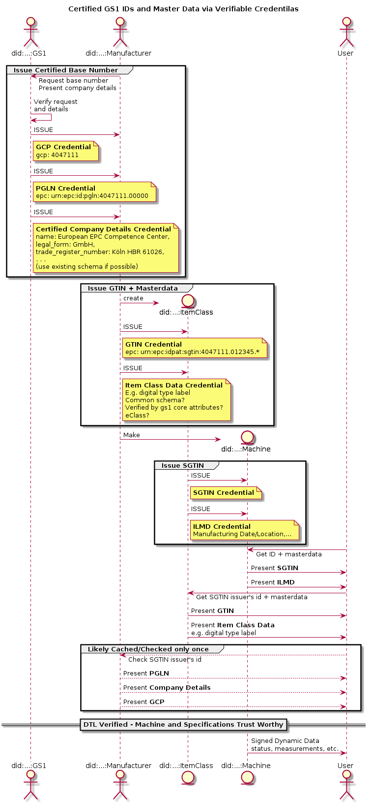

# Certified by GS1 implementtion using verifiable credentials

Here we develop the basic protocol and verifiable credential schemas for the use cases currently considered in certified by GS1.

The main story is summarised in the follwoing sequence diagram:

